# Anotações Sobre Python
📚 Minhas anotações feitas na faculdade de ADS da matéria Linguagem de Programação (Python) 📝

---
## Python 3 

> ## Unidade 1

O PEP 8 é o "Python Enhancement Proposal 8", que é um guia de estilo para a escrita de código python.
O PEP 8 recomenda o uso de espaços em branco de maneira de consistente, incluindo a indentação de 4 espaços (não tabulações).

- Usar **nomes descritivos minúsculos para variáveis e funções** (por exemplo, **minha_variável**);
- Usar **letras maiúsculas separadas por sublinhados para nomes de classes** (por exemplo, **Minha_Classe**);
- Recomenda-se manter linhas de código com até 79 caracteres de comprimento;
- Importações devem ser organizadas de forma ordenada e agrupadas em seções.

---
## 𝐕𝐚𝐫𝐢𝐚́𝐯𝐞𝐢𝐬 𝐞 𝐓𝐢𝐩𝐨𝐬 𝐝𝐞 𝐃𝐚𝐝𝐨𝐬 🔠
O interpretador Python consegue **estabelecer o tipo de dado da variável observando seu valor.** Confira alguns exemplos:

- x = 10
- nome = 'aluno'
- nota = 8.75
- fez_inscricao = True

Observe que:
- x= número inteiro
- nome= string
- nota= número decimal
- fez_inscricao= booleano

Será que Python é capaz de definir o tipo de variável somente com base no valor fornecido em cada variável?

Utilizaremos a função print() e type().

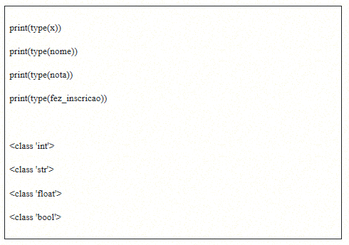

Como esperado, o Python acertou todos os tipos de variáveis. Note, também, que em Python tudo é objeto. Sendo assim, os tipos de dados aparecem com a palavra “class”, que é uma classe.

---
## 𝐎𝐩𝐞𝐫𝐚𝐝𝐨𝐫𝐞𝐬 𝐑𝐞𝐥𝐚𝐜𝐢𝐨𝐧𝐚𝐢𝐬 🌐

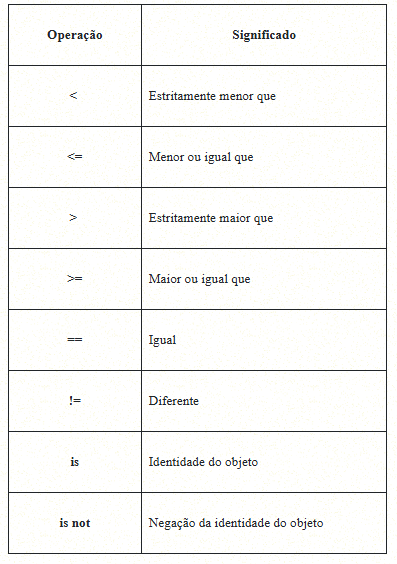

Além dos operadores relacionais, que comparam valores, também utilizamos operadores booleanos para construir decisões mais complexas em programação. Os operadores booleanos ajudam a combinar diferentes condições e a orientar o fluxo do programa de acordo com a lógica desejada.

- **Operador “E” (and)** - O operador “E” (and) permite a realização da operação lógica “E”. Isso significa que, ao usar a expressão (a and b), o resultado será “Verdadeiro” somente quando ambos os argumentos, “a” e “b”, forem verdadeiros. Caso contrário, o resultado será “Falso”.
- **Operador “OU” (or)** - O operador “OU” (or) realiza a operação lógica “OU”. Ao utilizar a expressão (a or b), o resultado será “Verdadeiro” se pelo menos um dos argumentos, “a” ou “b”, for verdadeiro. A expressão será “Falsa” apenas quando ambos os argumentos forem falsos.
- **Operador “NÃO” (not)** - O operador “NÃO” (not) é responsável por inverter o valor do argumento. Ao aplicarmos a expressão (not a), ela transformará “Verdadeiro” em “Falso”, e vice-versa. Ou seja, se o argumento for verdadeiro, a operação o tornará falso, e, se for falso, a operação o tornará verdadeiro.

Operadores booleanos são usados para controlar o fluxo de execução com base em condições complexas e, assim, tornam viável a elaboração de programas que tomam decisões de acordo com critérios específicos.

---
## 𝐄𝐬𝐭𝐫𝐮𝐭𝐮𝐫𝐚𝐬 𝐜𝐨𝐧𝐝𝐢𝐜𝐢𝐨𝐧𝐚𝐢𝐬 𝐢𝐟, 𝐞𝐥𝐬𝐞 𝐞 𝐞𝐥𝐢𝐟 🔃

- A condição “se o semáforo estiver verde” é satisfeita (verdadeira), então você segue em frente (if).
- A condição “se o semáforo estiver vermelho” não é satisfeita (falsa), então você para (else).

Resumindo:
- **if = se** (exemplo: se estiver verde, siga em frente)
- **else = ao contrário** (exemplo: caso contrário de verde, vermelho, pare)

O comando elif, em Python, é uma abreviação de “else if”, sendo usado em estruturas condicionais para avaliar **múltiplas condições em sequência.**

**1- Avaliação em sequência:** quando um bloco if é usado, a condição é avaliada. Se a condição for verdadeira, o bloco de código dentro desse if é executado. No entanto, em muitos cenários, você deseja avaliar uma série de condições em sequência, e o elif permite esse processo.

**2- Verificação múltipla:** após o bloco if, você pode usar um ou mais blocos elif, cada um com sua própria condição. O Python avalia essas condições em ordem, do topo para baixo. Assim que uma condição for verdadeira, o bloco de código associado a essa condição será executado e as condições subsequentes serão ignoradas.

**3- Flexibilidade:** o elif é flexível porque permite que você trate de múltiplos casos sem precisar aninhar uma série de blocos if. Isso torna o código mais legível e eficiente.

**Vamos verificar o exemplo de código a seguir:**

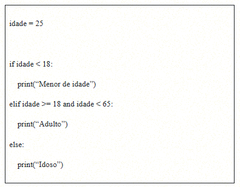

Repare na estrutura do if, elif e else. Ao final, definimos o que será feito com “:”. Além disso, utilizamos operadores relacionais e o “and” para combinar duas condições.

---
## 𝐄𝐬𝐭𝐫𝐮𝐭𝐮𝐫𝐚𝐬 𝐝𝐞 𝐫𝐞𝐩𝐞𝐭𝐢𝐜̧𝐚̃𝐨 𝐟𝐨𝐫 𝐞 𝐰𝐡𝐢𝐥𝐞 📶

- **FOR**

O **for** em Python é uma estrutura de repetição **usada para executar ações várias vezes de forma controlada.** Ele percorre elementos de uma lista ou sequência e executa um código para cada um deles. É útil quando já sabemos quantas repetições serão feitas ou quando precisamos processar uma coleção de itens.

Confira, a seguir, o exemplo simples de um loop for que itera por uma lista de números e imprime cada número:

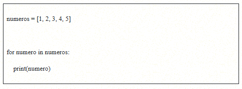

Nesse exemplo, a variável ‘numero’ assume o valor de cada elemento da lista ‘numeros’ em sequência, e o bloco de código dentro do loop é executado para cada valor. Isso resultará na impressão dos números de 1 a 5.

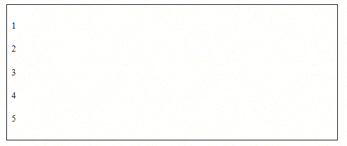

- **WHILE**

O **while** em Python é **usado para repetir um bloco de código sem saber previamente quantas vezes será necessário.** Ele executa enquanto a condição for verdadeira, sendo ideal quando a repetição deve durar até que uma condição específica seja satisfeita

Acompanhe, a seguir, um exemplo simples de uso do while para verificar se um número inserido pelo usuário é par ou ímpar e encerrar o programa quando o número zero for inserido:

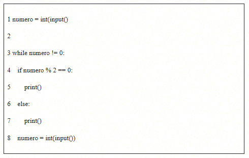

Nesse caso, o bloco de código dentro do **while** é executado repetidamente enquanto a condição **numero != 0 for verdadeira.** Isso permite que o programa solicite ao usuário números repetidamente até que o número zero seja inserido, encerrando o programa. O while é uma ferramenta valiosa para lidar com situações em que a iteração é necessária, mas o número de repetições não é conhecido com antecedência.

---
## 𝐂𝐨𝐧𝐭𝐫𝐨𝐥𝐞 𝐝𝐞 𝐫𝐞𝐩𝐞𝐭𝐢𝐜̧𝐚̃𝐨: 𝐫𝐚𝐧𝐠𝐞, 𝐛𝐫𝐞𝐚𝐤 𝐞 𝐜𝐨𝐧𝐭𝐢𝐧𝐮𝐞 ⏯

A função **range()**, em Python, é uma ferramenta útil para criar sequências numéricas que podem ser usadas em estruturas de repetição, como o comando for. Ela oferece flexibilidade ao especificar os limites e o incremento da sequência.

- **Método 1 – Repetição por quantidade**

No primeiro método, você pode passar um único argumento para **range()**, que representa a quantidade de vezes em que o loop deve ser repetido. Por exemplo, **range(5)** cria uma sequência que se inicia em 0 e vai até 4, realizando 5 iterações.

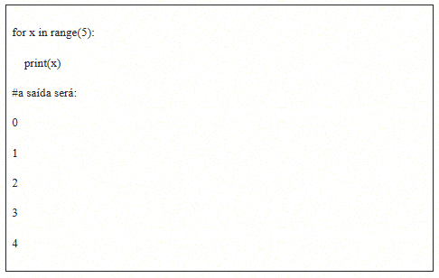

- **Método 2 – Limites inicial e superior**

No segundo método, você pode fornecer dois argumentos para **range()**. O primeiro argumento representa o início das repetições e o segundo, o limite superior (não incluso) do valor da variável de controle. Por exemplo, **range(2, 7)** cria uma sequência que se inicia em 2 e vai até 6, realizando 5 iterações.

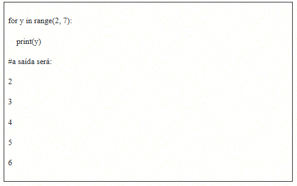

- **Método 3 – Com incremento**

No terceiro método, você pode passar três argumentos para **range()**. O primeiro argumento é o início das repetições, o segundo é o limite superior (não incluso) e o terceiro argumento representa o incremento entre cada iteração. Por exemplo, **range(1, 11, 2)** cria uma sequência que começa em 1, vai até 10 e incrementa de 2 em 2, resultando nas iterações de 1, 3, 5, 7 e 9.

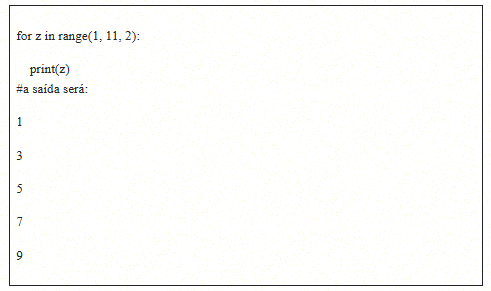

No Python, os comandos **break** e **continue** controlam o fluxo dos loops.
- O **break encerra o loop quando uma condição é atendida, saindo dele antes do fim.**
- Já o **continue faz o loop pular a iteração atual e seguir para a próxima, sem encerrar o loop inteiro.**

Suponha que desejemos encontrar o primeiro número par em uma sequência e interromper a iteração assim que o acharmos:

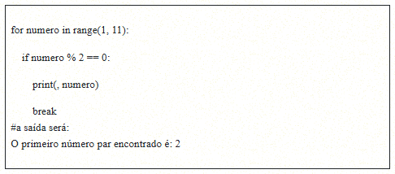

Nesse exemplo, o loop “for” itera de 1 a 10, mas, assim que encontra o primeiro número par (2), o comando “break” é acionado. Desse modo, interrompe-se a execução do loop.

O comando “continue” é usado para pular a iteração atual em uma estrutura de repetição e continuar com a próxima iteração. Isso é vantajoso quando você deseja ignorar uma iteração com base em uma condição, mas quer continuar com o restante do loop.
Vamos considerar um loop que imprime todos os números de 1 a 10, exceto o número 5:

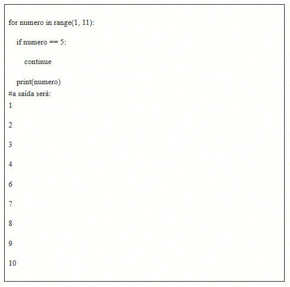

Nesse caso, quando o número é igual a 5, o comando “continue” é acionado, fazendo com que a iteração atual seja abandonada. A execução continua com o próximo número.

Em resumo, o **“break”** e o **“continue”** são comandos úteis para controlar o fluxo em estruturas de repetição, permitindo interromper loops antecipadamente com **“break”** e pular iterações específicas com **“continue”**, com base em condições específicas.

---
## 𝐅𝐮𝐧𝐜̧𝐨̃𝐞𝐬 𝐛𝐮𝐢𝐥𝐭-𝐢𝐧

Confira, a seguir, o exemplo que utiliza a função built-in **len()** para calcular o comprimento de uma lista e, em seguida, imprime o resultado com comentários explicativos:

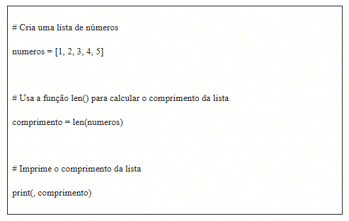

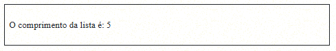

Nesse caso, criamos uma lista chamada “números”, com cinco elementos. Em seguida, usamos a função len() para calcular o comprimento dessa lista e armazenamos o resultado na variável “comprimento”. Por fim, imprimimos o valor do comprimento com uma mensagem explicativa.

## 𝐅𝐮𝐧𝐜̧𝐚̃𝐨 𝐝𝐞𝐟𝐢𝐧𝐢𝐝𝐚 𝐩𝐞𝐥𝐨 𝐮𝐬𝐮𝐚́𝐫𝐢𝐨 (𝐜𝐨𝐦 𝐫𝐞𝐭𝐨𝐫𝐧𝐨 𝐞 𝐩𝐚𝐫𝐚̂𝐦𝐞𝐭𝐫𝐨)

Além das funções prontas do Python, podemos criar nossas próprias funções para resolver problemas específicos. Nessas funções, o programador define o nome, os dados de entrada e o resultado, o que permite personalizar soluções de acordo com as necessidades do projeto.

Acompanhe o exemplo de uma função que calcula a soma de dois números:

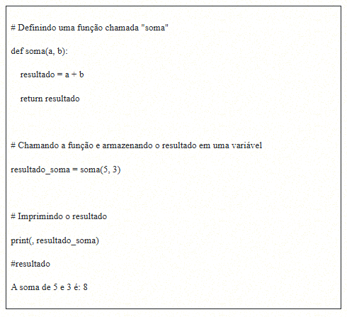

Nesse exemplo, definimos uma função chamada “soma”, que aceita dois argumentos: **a** e **b**. Dentro da função, realizamos a operação de adição entre esses dois números e retornamos o resultado. Em seguida, chamamos a função com os valores 5 e 3, e armazenamos o resultado retornado em uma variável chamada “resultado_soma”. Por fim, imprimimos o resultado.

Outro exemplo interessante de ser observado é a criação de uma função para definir se um número é par:

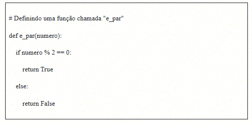

Repare que definimos a função e utilizamos o operador “%”, que, em Python, é conhecido como operador de módulo ou operador de resto. Ele é usado para calcular o resto da divisão de um número pelo outro. Em uma expressão como **a % b**, o operador **%** retorna o valor do resto quando a é dividido por **b**.

Sendo assim, se um número é dividido por 2 e tem resto zero, então esse número é par.

Vamos testar essa função para dois valores: **123.120** e **1.355.989**

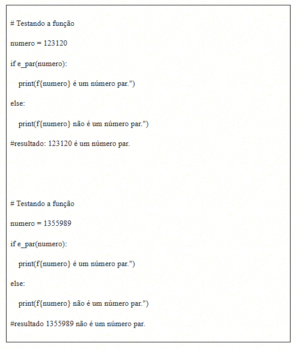

Note que a função retornou que o primeiro número é par e o segundo, não. Nesses exemplos, percebemos como é feita uma função definida por nós.

---
> ## Unidade 2

Em Python, a premissa fundamental é a de que tudo gira em torno de objetos. De acordo com a Python Software Foundation (PSF), todos os dados em um programa Python são representados por objetos ou pela relação entre objetos.

- **Conheceremos três estruturas de dados: sequência, lista e tuplas.**

**Sequências** = São estruturas de dados que nos permitem armazenar **coleções ordenadas de informações.**

**Listas** =  Consistem em uma forma fundamental de objetos do tipo sequência e são mutáveis, o que significa que nesse caso podemos **adicionar, remover e alterar elementos.**

**Tuplas** = São praticamente semelhantes às listas, mas com uma diferença crucial: **elas são imutáveis**. Isso significa que, uma vez criadas, as tuplas não podem ser alteradas.

## 𝐎𝐛𝐣𝐞𝐭𝐨𝐬 𝐝𝐨 𝐭𝐢𝐩𝐨 𝐬𝐞𝐪𝐮𝐞̂𝐧𝐜𝐢𝐚

Os objetos do tipo sequência são como coleções versáteis que podem **armazenar vários valores**. Eles servem para organizar dados em uma ordem específica e são indexados por números inteiros não negativos.

O primeiro elemento da sequência é acessado pelo índice 0, o segundo, pelo índice 1, e assim por diante, até o último elemento, que está na posição n - 1, onde n representa a capacidade de armazenamento da sequência.

O grupo de estruturas de dados que se encaixam nessa categoria compartilha algumas operações comuns.

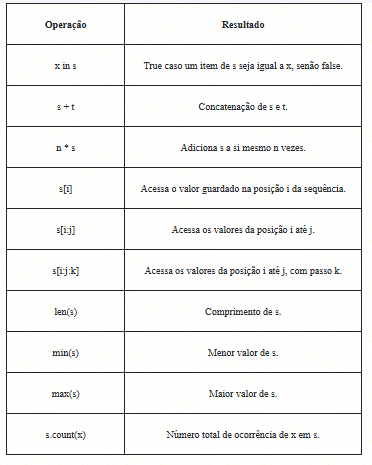

**Quadro 1 | Operações em comum dos objetos do tipo sequência.**

Um texto, representado por objetos da classe **str (strings)**, é uma forma de sequência. Essas strings oferecem uma variedade de operações, como as descritas no Quadro 1, apresentado anteriormente.

No entanto, é importante notar que as strings são objetos imutáveis, o que significa que não é possível modificar seu conteúdo atribuindo um novo valor a uma posição específica.

Vamos, agora, experimentar algumas dessas operações.

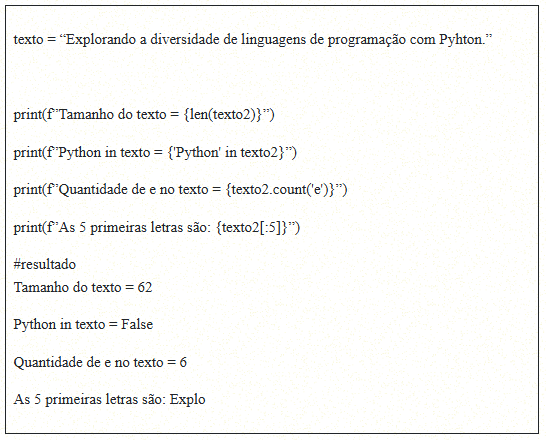

Na primeira demonstração, vimos algumas operações básicas para trabalhar com sequências em Python. A função **len()** mostra o tamanho da sequência. O operador **in** verifica se um valor está dentro da sequência. O método **count** conta quantas vezes um valor aparece. Também podemos usar colchetes para pegar partes específicas da sequência, como os elementos do índice 0 até 5.

## 𝐋𝐢𝐬𝐭𝐚𝐬

As listas são estruturas de dados em Python conhecidas por sua mutabilidade, o que significa que você pode adicionar ou remover elementos conforme necessário. **São estruturas indexadas, ou seja, cada elemento tem uma posição, começando em 0.**

Considere o código a seguir, no qual criamos uma lista chamada **“cores”** e, em seguida, usamos uma estrutura de repetição para imprimir cada elemento junto com seu índice.

- Observe a função **index**, que retorna à posição de um valor na lista.

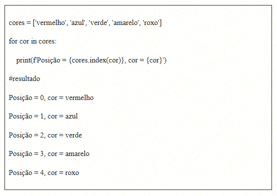

- As **list comprehensions**, ou listcomps, são uma abordagem pythônica para criar listas com base em objetos iteráveis. Essa técnica é especialmente útil quando você deseja transformar ou filtrar as informações de uma sequência existente para construir uma nova sequência com as informações desejadas.

Para ilustrar essa técnica, vamos considerar um exemplo no qual temos uma lista de palavras e queremos **convertê-las em letras minúsculas.**

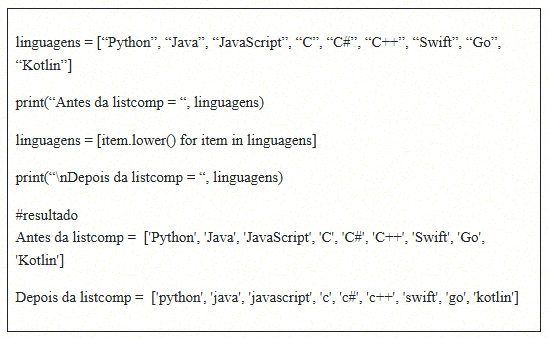

No exemplo apresentado anteriormente, criamos a lista “linguagens”, que contém várias linguagens de programação. Em seguida, aplicamos uma list comprehension. No interior dos colchetes, utilizamos a variável “item” para representar cada elemento da lista original. Com a expressão “item.lower()”, transformamos cada elemento em minúsculas e substituímos os valores originais na mesma variável “linguagens”. Por fim, imprimimos a lista antes e depois da aplicação da list comprehension.

- Agora, vamos explorar as funções **map()** e **filter()** em Python, que são usadas para manipular listas e aplicar transformações ou filtragens a elementos iteráveis. Primeiro, vou apresentar exemplos diferentes para cada função.

Suponha que você tenha uma lista de preços em dólares e deseje convertê-los para reais usando uma taxa de câmbio fixa:

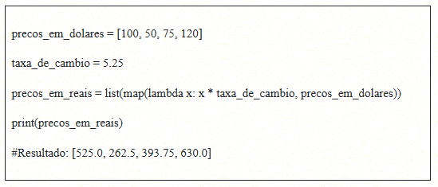

Nesse caso, usamos a função **map()** para aplicar uma função lambda que multiplica cada preço em dólares pela taxa de câmbio. Depois, convertemos o resultado em uma lista. O resultado será uma lista com os preços em reais.

- Agora, imagine que você tenha uma lista de números e queira filtrar apenas os números pares:

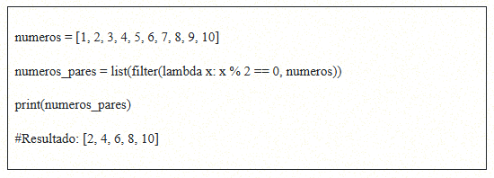

Nesse exemplo, usamos a função **filter()** com uma função lambda que verifica se um número é par (resto da divisão por 2 igual a 0) e, em seguida, convertemos o resultado em uma lista. O resultado será uma lista contendo apenas os números pares.

## 𝐓𝐮𝐩𝐥𝐚𝐬

As tuplas são estruturas de dados pertencentes ao grupo de objetos do tipo sequência em Python. A principal distinção entre listas e tuplas é o fato de que as listas são mutáveis, permitindo a atribuição de valores a posições específicas, enquanto as tuplas são objetos imutáveis.

Você pode criar tuplas em Python de três maneiras:

**1** - Usando um par de parênteses para denotar uma tupla vazia: **tupla1 = ().**
**2** - Usando um par de parênteses e elementos separados por vírgulas: **tupla2 = ('a', 'b', 'c').**
**3** - Usando o construtor de tipo **tuple().**

Um exemplo no qual criamos uma tupla chamada “vogais” e, posteriormente, usamos uma estrutura de repetição para imprimir cada elemento da tupla, juntamente com sua posição:

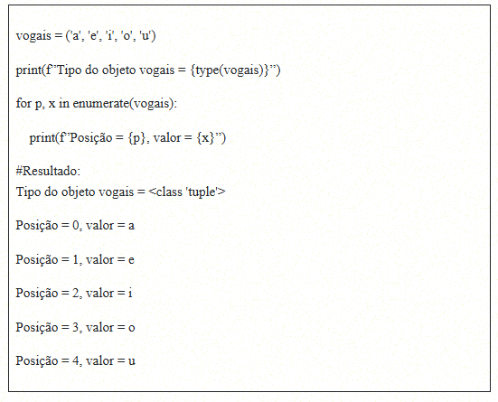

Nesse exemplo, utilizamos a função **enumerate()** para obter tanto a posição quanto o valor de cada elemento na tupla. É importante observar que as tuplas são imutáveis, o que significa que, uma vez criadas, não é possível alterar seu conteúdo.

Isso as torna úteis em situações nas quais a ordem dos elementos deve permanecer inalterada. Além disso, as tuplas têm um papel fundamental em várias operações em Python, como no desempacotamento de valores e no retorno múltiplo de funções.

---
## 𝐎𝐛𝐣𝐞𝐭𝐨𝐬 𝐝𝐨 𝐭𝐢𝐩𝐨 𝐬𝐞𝐭

Em Python, **"set"** é uma estrutura de dados inspirada nos conjuntos matemáticos: não permite duplicatas, facilita testes de associação e possibilita operações como união, interseção e diferença.

Além das operações familiares que já conhecemos para sequências, como **len(s)**, **x in s** e **x not in s**, os conjuntos oferecem funcionalidades adicionais. Podemos agregar um novo elemento a um conjunto usando **add(valor)** e remover elementos com **remove(valor)**.

Em Python, existem duas formas principais de criar objetos do tipo “set”:

- Usando um par de chaves e elementos separados por vírgulas, por exemplo: **set1 = {'a', 'b', 'c'}.**
- Usando o construtor de tipo **set(iterable)** com um objeto iterável, como uma lista, uma tupla ou mesmo uma sequência de caracteres (string).

Confira, a seguir, um exemplo de criação de conjuntos:

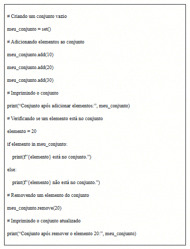

Nesse código, criamos um conjunto vazio, chamado **meu_conjunto**, e adicionamos elementos a ele usando o método **add()**. Em seguida, verificamos se um elemento específico está no conjunto utilizando a instrução **in**. Por fim, removemos um elemento com o método **remove()** e imprimimos o conjunto atualizado. Conjuntos são úteis para armazenar valores únicos e efetuar operações de pertencimento.

## 𝐎𝐛𝐣𝐞𝐭𝐨𝐬 𝐝𝐨 𝐭𝐢𝐩𝐨 𝐦𝐚𝐩𝐩𝐢𝐧𝐠

Em Python, dicionários **(dict)** são estruturas de mapeamento que relacionam chaves a valores de forma mutável, permitindo atualizar ou adicionar pares dinamicamente.

Podemos criar dicionários em Python das seguintes maneiras:

- Usando um par de chaves para denotar um dicionário vazio: **dicionario1 = {}**.
- Usando pares de elementos na forma **“chave: valor”** separados por vírgulas: **dicionario2 = {‘um’: 1, ‘dois’: 2, ‘três': 3}**.
- Usando o construtor de tipo **dict()**.

Observe, a seguir, alguns exemplos desses diferentes modos de criar um dicionário:

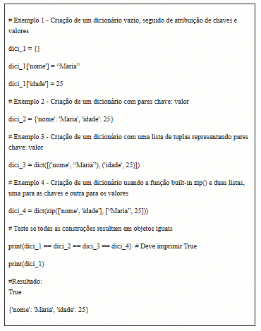

Mostramos quatro maneiras distintas de criar dicionários e atribuir valores a eles. Para acessar um valor em um dicionário, use a notação **nome_dicionario[chave]**. Já para atribuir um novo valor, utilize **nome_dicionario[chave] = novo_valor**. Dicionários são úteis para armazenar informações associadas por chaves exclusivas.

## 𝐎𝐛𝐣𝐞𝐭𝐨𝐬 𝐝𝐨 𝐭𝐢𝐩𝐨 𝐚𝐫𝐫𝐚𝐲 𝐍𝐮𝐦𝐏𝐲

Em Python, a biblioteca **NumPy** se destaca entre as estruturas de dados por oferecer arrays multidimensionais, funções avançadas e integração com C/C++ e Fortran, além de recursos como álgebra linear, transformadas de Fourier e geração de números aleatórios.

- Para começar a utilizar o **NumPy**, é necessário instalá-lo no ambiente Python. Você pode fazer isso facilmente com o comando **pip install numpy**. Em plataformas como o Anaconda ou Google Colab, o NumPy já está incluído.
- Depois de instalado, você deve importar a biblioteca em seu projeto usando o comando **import numpy** sempre que quiser aproveitar seus recursos vantajosos.

Confira o código a seguir:

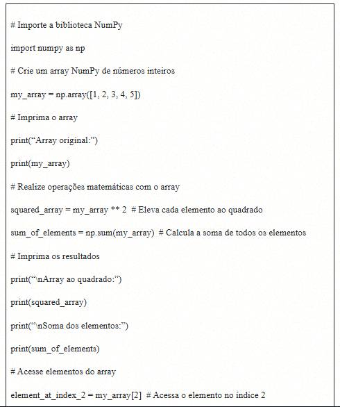

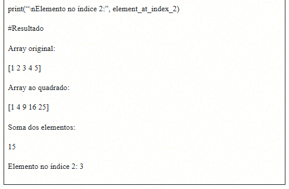

Nesse código, importamos o NumPy como **np**, criamos um array NumPy chamado **my_array**, realizamos operações matemáticas nele e acessamos elementos por índice. O NumPy oferece uma maneira eficiente de trabalhar com matrizes e executar operações em massa.

---
## 𝐂𝐥𝐚𝐬𝐬𝐞𝐬

Python é uma linguagem que oferece suporte ao paradigma orientado a objetos, viabilizando a implementação de encapsulamento, herança e polimorfismo.

A criação de uma classe em Python é feita com a palavra reservada “class”, seguida do nome da classe, e em um bloco indentado são definidos os atributos e métodos.

 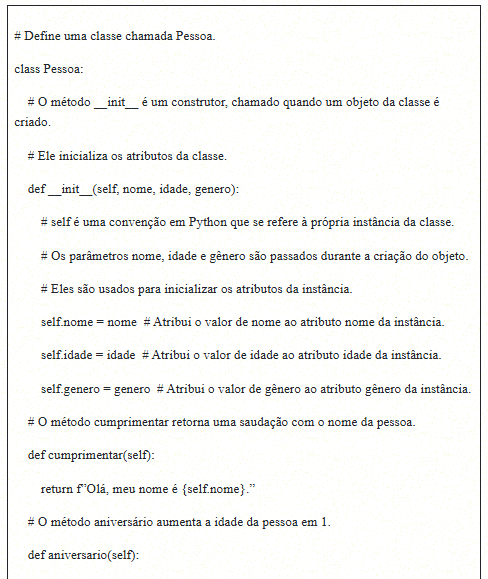

 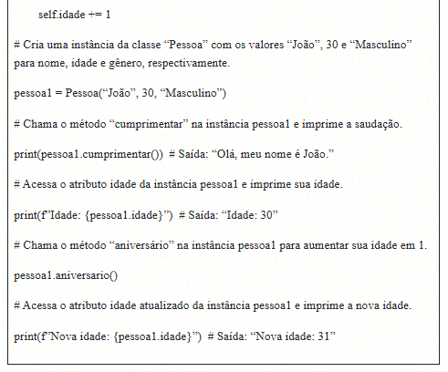

Nesse exemplo, criamos a classe “Pessoa” com os atributos nome, idade e gênero, bem como os métodos cumprimentar e aniversário. Depois, construímos uma instância da classe “pessoa1” e demonstramos como acessar os atributos e chamar os métodos dessa instância.

O construtor da classe __init__() é capaz de receber um valor diferente para cada objeto, o que é de suma importância na construção da classe. Note que nesse caso determinamos dois tipos diferentes de atributos: duas strings (nome e gênero) e um int (idade).

## 𝐇𝐞𝐫𝐚𝐧𝐜̧𝐚

A herança é um dos pilares fundamentais da programação orientada a objetos, pois permite que uma classe (a classe-filha) herde características e comportamentos de outra classe (a classe-pai). Em Python, essa técnica é amplamente suportada e flexível, possibilitando que uma classe-filha herde de múltiplas classes-pai, processo que configura um conceito conhecido como herança múltipla.

A sintaxe para criar uma classe-filha que herda de uma classe-pai é simples e legível. A classe-filha é definida após o nome da classe-pai, entre parênteses.

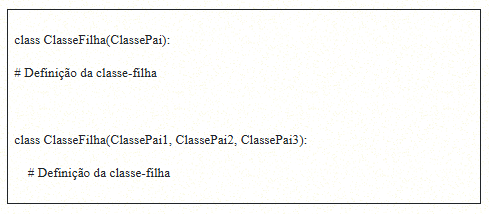

**-** 𝐁𝐞𝐧𝐞𝐟𝐢́𝐜𝐢𝐨𝐬 𝐝𝐚 𝐡𝐞𝐫𝐚𝐧𝐜̧𝐚

**1- Reutilização de código:** a herança permite que você reutilize o código existente, aproveitando a estrutura e a funcionalidade de classes-pai em suas subclasses.
 
**2- Extensibilidade:** você pode estender ou adicionar comportamentos específicos às classes-filhas sem modificar as classes-pai, mantendo a coesão e a organização do código.
 
**3- Hierarquia de classes:** é possível criar uma hierarquia de classes na qual classes-filhas podem herdar características comuns de classes-pai e, por sua vez, serem herdadas por outras classes.

Imagine um cenário no qual tenhamos uma classe-pai chamada “Animal” com atributos e métodos gerais para representar qualquer animal. Podemos criar classes-filhas, como “Cachorro” e “Gato,” que herdam essas características gerais, mas que também podem ter comportamentos específicos, como latir e miar, respectivamente.

Dessa forma, aproveitamos a reutilização de código e estendemos funcionalidades de acordo com a necessidade.

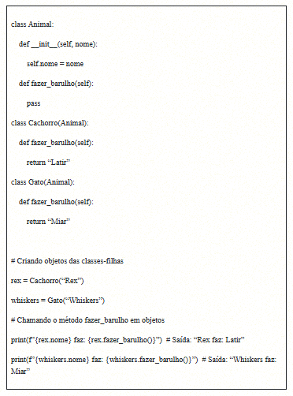

Nesse exemplo, criamos objetos “rex” e “whiskers” das classes-filhas “Cachorro” e “Gato”, respectivamente. Em seguida, chamamos o método fazer_barulho() em cada objeto para determinar o som que cada animal faz. Isso ilustra a herança em ação, quando as classes-filhas herdam o método da classe-pai, mas podem fornecer suas próprias implementações.

---
## 𝐌𝐨́𝐝𝐮𝐥𝐨𝐬 𝐞 𝐛𝐢𝐛𝐥𝐢𝐨𝐭𝐞𝐜𝐚

Em Python, o código é organizado com funções, classes e módulos, que permitem separar funcionalidades em arquivos .py independentes. Isso facilita a manutenção e a reutilização.

Módulos funcionam como bibliotecas de funções específicas, oferecendo recursos como operações matemáticas (math) ou manipulação de arquivos e pastas (os). Eles tornam o código mais organizado e reaproveitável.

- Como utilizar um módulo?

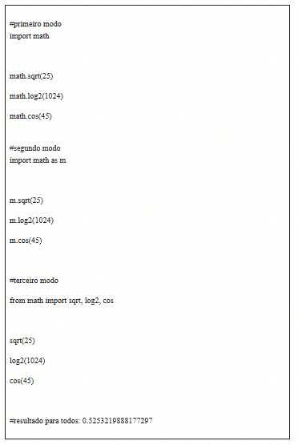

No primeiro modo, usamos a importação que carrega todas as funções na memória, trouxemos toda a funcionalidade de “math” e colocamos math.sqrt, por exemplo, para chamar a função sqrt.

No segundo modo, utilizamos a importação que carrega todas as funções na memória, mas, nesse caso, demos um apelido para o módulo. Utilizamos m.sqrt, por exemplo, para chamar a função sqrt.

No terceiro modo, usamos a importação que carrega funções específicas na memória, utilizando-a diretamente – sqrt(), por exemplo.

## 𝐂𝐥𝐚𝐬𝐬𝐢𝐟𝐢𝐜𝐚𝐜̧𝐚̃𝐨 𝐝𝐨𝐬 𝐦𝐨́𝐝𝐮𝐥𝐨𝐬 (𝐛𝐮𝐢𝐥𝐭-𝐢𝐧, 𝐝𝐞 𝐭𝐞𝐫𝐜𝐞𝐢𝐫𝐨𝐬 𝐞 𝐩𝐫𝐨́𝐩𝐫𝐢𝐨𝐬)

Podemos classificar os módulos (bibliotecas) em três categorias:

**1- Módulos built-in:** embutidos no interpretador.

**2- Módulos de terceiros:** criados por terceiros e disponibilizados via PyPI.

**3- Módulos próprios:** criados pelo desenvolvedor.

Os módulos built-in fazem parte do núcleo do Python e estão disponíveis diretamente no interpretador, sem necessidade de instalação. Eles fornecem funcionalidades básicas comuns a muitos programas, como **math, os, svs, random, datetime, re** e **collections.**

Já os módulos de terceiros são criados por desenvolvedores externos e não fazem parte da biblioteca padrão. Geralmente são distribuídos pelo PyPI e podem ser instalados para adicionar funcionalidades extras aos programas Python.

**1-** Ampliam a funcionalidade do Python em diversas áreas, como na manipulação de dados, gráficos, interfaces gráficas, integração com bancos de dados e aprendizado de máquina.

**2-** A instalação é feita usando o gerenciador de pacotes padrão: pip. Exemplo: **pip install requests.**

**3-** Gerenciar dependências é essencial à medida que projetos crescem. O uso de um arquivo requirements.txt facilita a instalação de todas as dependências em um único comando pip.

**4-** Ambientes virtuais isolam projetos Python para evitar conflitos entre diferentes versões de módulos de terceiros.

**5-** Conhecer as licenças dos módulos de terceiros é importante, pois eles podem variar de código aberto a proprietário, e a qualidade da manutenção pode mudar.

**6-** Módulos de terceiros geralmente possuem comunidades ativas de desenvolvedores e documentação rica, fornecendo suporte e recursos valiosos.

Exemplos de módulos de terceiros incluem **NumPy, pandas** e **Matplotlib.**

Os módulos próprios (ou personalizados) são criados pelo próprio desenvolvedor para organizar e reutilizar código. Eles tornam o programa mais legível, manutenível e permitem criar bibliotecas personalizadas, promovendo a modularização — prática recomendada no desenvolvimento de software.

## 𝐌𝐚𝐭𝐩𝐥𝐨𝐭𝐥𝐢𝐛

O **Matplotlib** é uma das bibliotecas de visualização mais populares em Python, oferecendo recursos para criar gráficos estáticos, interativos e animações de forma flexível.

Normalmente, utiliza-se o módulo **pyplot**, que fornece uma interface de alto nível para construir gráficos de maneira prática.

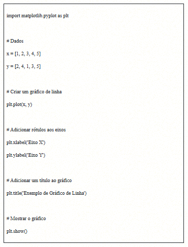

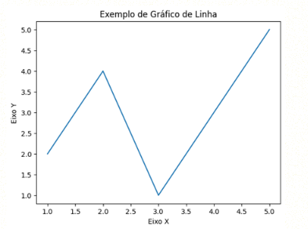

Nesse exemplo:

**1-** Importamos o módulo **pyplot** do Matplotlib como **plt.**

**2-** Definimos listas x e y, que representam os pontos do gráfico.

**3-** Usamos **plt.plot(x, y)** para criar o gráfico de linha.

**4-** Adicionamos rótulos aos eixos X e Y com **plt.xlabel()** e **plt.ylabel().**

**5-** Adicionamos um título ao gráfico com **plt.title().**

**6-** Por fim, usamos **plt.show()** para exibir o gráfico.

O código apresentado anteriormente cria um simples gráfico de linha com os pontos (1, 2), (2, 4), (3, 1), (4, 3) e (5, 5), rotulando os eixos e dando um título ao gráfico.

O Matplotlib disponibiliza uma variedade de opções de personalização para gráficos, permitindo que você ajuste cores, estilos de linha, marcadores e muitos outros aspectos. Trata-se de uma biblioteca eficiente para criar gráficos de alta qualidade em Python, sendo amplamente utilizada na análise e visualização de dados.

---
> ## Unidade 3

# 𝐌𝐚𝐭𝐩𝐥𝐨𝐭𝐥𝐢𝐛 𝟏.𝟏

O Matplotlib, criado por John Hunter, é uma biblioteca essencial em Python para visualização de dados, substituindo o uso de softwares externos como gnuplot e MATLAB.

Sua instalação é simples com pip install **matplotlib**, e o módulo **pyplot** facilita a criação de gráficos, geralmente importado como **plt**.

Os gráficos permitem narrar dados visualmente, podendo ser exemplificados com valores aleatórios gerados pelo módulo random e representados em um gráfico de linhas.

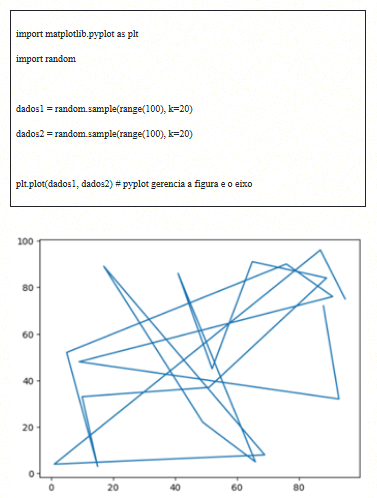

Existem duas formas de criar o gráfico:

- O pyplot cria e gerencia automaticamente figuras e eixos, e usa as funções do pyplot para plotagem.
- Criar explicitamente figuras e eixos, e chamar métodos sobre eles (o “estilo orientado a objetos (OO)”).

No gráfico criado, utilizamos a opção 1, ou seja, foi o próprio módulo que criou o ambiente da figura e do eixo. 

# 𝐁𝐢𝐛𝐥𝐢𝐨𝐭𝐞𝐜𝐚 𝐒𝐞𝐚𝐛𝐨𝐫𝐧

O Seaborn, uma biblioteca Python construída sobre a base do Matplotlib, destaca-se na criação de gráficos de forma especializada. Você pode usar essa biblioteca importando-a em seus projetos da seguinte forma: “import seaborn as sns”. Uma característica notável do Seaborn é seu repositório de conjuntos de dados prontos para uso, o que facilita a exploração das funcionalidades.

Você pode acessar esses conjuntos de dados em [mwaskom](https://github.com/mwaskom/seaborn-data). Para ilustrar, vamos carregar dados sobre gorjetas (tips) e utilizá-los em nosso estudo. O Seaborn simplifica a criação de gráficos e as análises de dados, mostrando-se uma ferramenta valiosa para a visualização de informações.

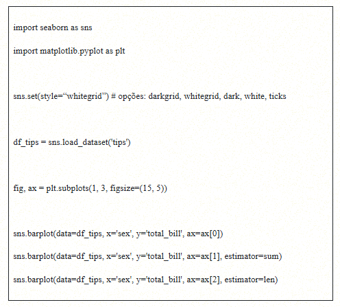

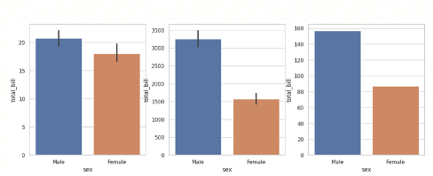

- A escolha entre **barplot()** do Seaborn e os gráficos de barras do pandas depende da análise, sendo o Seaborn mais flexível graças ao parâmetro estimator.
- O **barplot()** permite usar diferentes métricas, como soma e contagem, enquanto o pandas geralmente se limita à média.
- Exemplos mostram que a média sugere gastos semelhantes entre homens e mulheres, mas a soma aparenta maior gasto masculino, algo explicado pela diferença na quantidade de registros.
- Assim, a interpretação correta dos gráficos exige considerar o contexto dos dados para evitar conclusões equivocadas.

# 𝐁𝐢𝐛𝐥𝐢𝐨𝐭𝐞𝐜𝐚 𝐩𝐚𝐧𝐝𝐚𝐬

**Pandas é uma biblioteca open source do Python voltada para manipulação e análise de dados tabulares e séries temporais.** Oferece estruturas como DataFrames e Series, que tornam o trabalho com dados mais intuitivo e eficiente.

Algumas características notáveis do pandas incluem:

**1- DataFrames e Series:** estruturas flexíveis para dados em tabela (2D) e lista/matriz (1D).

**2- Manipulação:** funções para filtrar, selecionar, ordenar, agrupar e agregar.

**3- Leitura/escrita:** suporta vários formatos, como CSV, Excel e SQL.

**4- Dados ausentes:** permite preencher ou remover valores faltantes.

**5- Visualização:** integra-se a bibliotecas como Matplotlib e Seaborn.

**6- Integração:** construído sobre NumPy, unindo cálculos numéricos e manipulação de dados.

**7- Comunidade:** ativa, com suporte e atualizações constantes.

O pandas é amplamente utilizado em análise de dados, ciência de dados e engenharia de dados. Ele oferece uma maneira eficiente e amigável de lidar com dados.

Já conhecemos muitas funcionalidades da biblioteca pandas; uma delas diz respeito à visualização gráfica. As principais estruturas de dados da biblioteca pandas (Series e DataFrame) possuem o método plot(), construído com base no Matplotlib e que permite criar gráficos a partir dos dados nas estruturas.

Confira um exemplo:

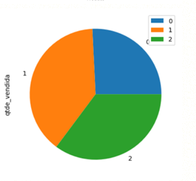

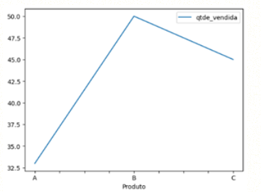

Existem muitas visualizações possíveis. No exemplo anterior, utilizamos os gráficos de barras, de pizza e de linhas. No endereço [pandas](https://pandas.pydata.org/pandas-docs/stable/reference/api/pandas.DataFrame.plot.html) você encontra a lista com todos os tipos de gráficos que podem ser construídos com o método plot() da biblioteca.

# 𝐒𝐞𝐫𝐢𝐞𝐬

Para criar um objeto do tipo Series no pandas, utilizamos o método **Series()** com vários parâmetros opcionais.

O principal parâmetro é **“data”**, que pode conter um único valor, uma lista de valores ou um dicionário. Outros parâmetros, como **“index”**, **“dtype”** e **“name”**, têm valores-padrão predefinidos, tornando sua especificação opcional.

**Exemplo 1: criar uma Series a partir de uma lista**

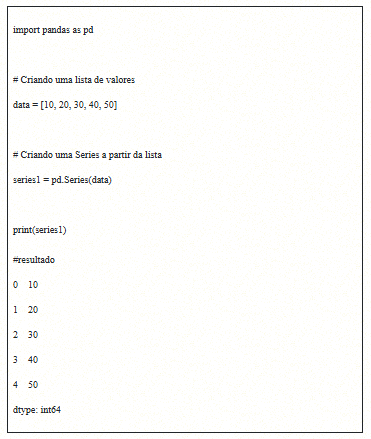

**Exemplo 2: criar uma Series a partir de um dicionário**

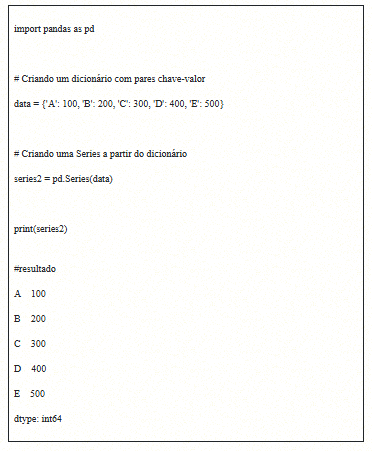

No primeiro exemplo, uma Series é criada a partir de uma lista de valores. Já no segundo, uma Series é criada a partir de um dicionário, de modo que as chaves se tornam os índices da Series e os valores são os dados correspondentes.

# 𝐋𝐞𝐢𝐭𝐮𝐫𝐚 𝐝𝐞 𝐝𝐚𝐝𝐨𝐬 𝐞𝐬𝐭𝐫𝐮𝐭𝐮𝐫𝐚𝐝𝐨𝐬 𝐜𝐨𝐦 𝐚 𝐛𝐢𝐛𝐥𝐢𝐨𝐭𝐞𝐜𝐚 𝐩𝐚𝐧𝐝𝐚𝐬

Um recurso poderoso no pandas é a capacidade de ler dados estruturados e armazená-los em um DataFrame. A biblioteca oferece vários métodos de leitura de dados, identificados pelo padrão “read”, como pandas.read_XXXXX(). Cada um desses métodos é projetado para ler diferentes tipos de fontes de dados.

- Para exemplificar, vamos explorar o método **pandas.read_html()**, que é utilizado para extrair tabelas de uma página da web.

Esse método identifica automaticamente elementos HTML <table> em uma página e retorna uma lista de DataFrames. O parâmetro “io” define a URL, e outros ajustes permitem tratar a formatação dos dados, tornando o pandas útil para adquirir informações de páginas web.

Na URL [Lista de bancos com falha](https://www.fdic.gov/bank-failures/failed-bank-list) encontra-se uma tabela com bancos norte-americanos que faliram desde 1º de outubro de 2000. Nesse caso, cada linha representa um banco.

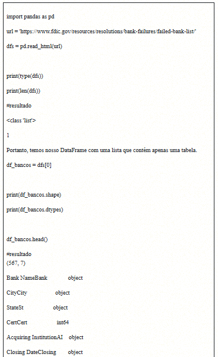
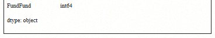

Nesse exemplo, trouxemos o tipo de cada variável existente no DataFrame, além das cinco primeiras linhas como o comando head(). Com isso, mostramos quão rica é a biblioteca pandas e suas diversas aplicações.

# 𝐋𝐢𝐧𝐠𝐮𝐚𝐠𝐞𝐦 𝐝𝐞 𝐜𝐨𝐧𝐬𝐮𝐥𝐭𝐚 𝐞𝐬𝐭𝐫𝐮𝐭𝐮𝐫𝐚𝐝𝐚 – 𝐒𝐐𝐋

A linguagem SQL (Structured Query Language) desempenha um papel fundamental na comunicação com bancos de dados relacionais. Ela foi inicialmente estabelecida como um padrão pelo American National Standards Institute (ANSI) em 1986 e passou por várias revisões desde então. Embora diferentes fornecedores de softwares de banco de dados, como Oracle e Microsoft, tenham adaptado o SQL com suas extensões e modificações exclusivas, ainda existe um núcleo comum de comandos SQL que é padrão em todos os sistemas.

As instruções em SQL podem ser agrupadas em três categorias principais:

**1 - DDL (Data Definition Language – Linguagem de Definição de Dados):**

- Define a estrutura do banco, permitindo criar, alterar e excluir bancos e tabelas (ex.: CREATE, ALTER, DROP).

**2- DML (Data Manipulation Language – Linguagem de Manipulação de Dados):**

- Manipula os dados, possibilitando consultar, inserir, atualizar e excluir registros (ex.: SELECT, INSERT, UPDATE, DELETE).

**3- DCL (Data Control Language – Linguagem de Controle de Dados):**

- Controla permissões e segurança, concedendo ou revogando acessos (ex.: GRANT, REVOKE).

Além das categorias, o SQL inclui recursos como agregações, junções, subconsultas e transações, permitindo consultas complexas e manipulação eficiente de dados. Sua flexibilidade o torna poderoso em qualquer SGBD, e apesar das variações entre fornecedores, a base comum garante consultas portáteis entre diferentes plataformas.

# 𝐂𝐨𝐧𝐞𝐱𝐚̃𝐨 𝐜𝐨𝐦 𝐛𝐚𝐧𝐜𝐨 𝐝𝐞 𝐝𝐚𝐝𝐨𝐬

Quando uma aplicação precisa interagir com um banco de dados relacional, é necessário estabelecer uma conexão para enviar comandos SQL. Tecnologias como ODBC (Open Database Connectivity) e JDBC (Java Database Connectivity) permitem essa comunicação entre a linguagem de programação e o RDBMS.

ODBC e JDBC fornecem acesso padronizado ao banco via API, possibilitando que aplicações usem diferentes SGBDs sem recompilar o código. Isso é feito por meio de drivers, que traduzem as chamadas para a linguagem do banco.

No Python, a conexão é feita com bibliotecas específicas que usam esses drivers. O PEP 249 define regras para módulos de acesso, incluindo o método connect(parameters...), que facilita a troca de bancos apenas ajustando os parâmetros de conexão.

O SQLite é uma biblioteca em C que implementa um banco SQL completo e confiável. Diferente de outros SGBDs, não precisa de servidor, armazenando todo o banco (tabelas, índices, triggers e views) em um único arquivo no sistema.

- Python, a linguagem possui um módulo integrado chamado “sqlite3”, o qual permite a interação com o mecanismo do banco de dados SQLite.

Vamos criar um banco de dados!

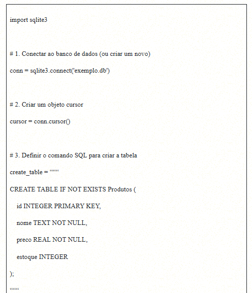
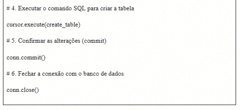

**1-** Importamos o módulo **sqlite3** e conectamos (ou criamos) um banco de dados chamado “exemplo.db”.

**2-** Criamos um objeto cursor que nos permite executar comandos SQL.

**3-** Definimos o comando SQL para criar a tabela “Produtos” com campos para “id”, “nome”, “preco” e “estoque”.

**4-** Executamos o comando SQL usando o cursor.

**5-** Confirmamos as alterações no banco de dados com **commit().**

**6-** Por fim, fechamos a conexão com o banco de dados.

O comando **CREATE TABLE** é um exemplo de DDL (Data Definition Language, ou Linguagem de Definição de Dados), pois possibilita a definição de uma nova estrutura de banco de dados.

# 𝐂𝐑𝐔𝐃 – 𝐂𝐑𝐄𝐀𝐓𝐄, 𝐑𝐄𝐀𝐃, 𝐔𝐏𝐃𝐀𝐓𝐄, 𝐃𝐄𝐋𝐄𝐓𝐄

Podemos inserir informações (create), ler (read), atualizar (update) e apagar (delete). Os passos necessários para efetuar uma das operações do CRUD são sempre os mesmos: (i) estabelecer a conexão com um banco; (ii) criar um cursor e executar o comando; (iii) gravar a operação; (iv) fechar o cursor e a conexão.

Vamos criar um exemplo no qual haverá a inserção de um novo produto na tabela “Produtos”. Suponhamos que você deseje adicionar um novo produto com nome, preço e quantidade em estoque.

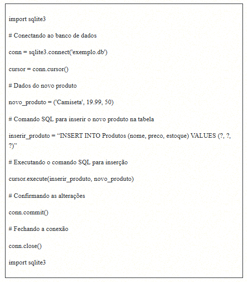

Confira, a seguir, um exemplo de como você pode recuperar todos os produtos da tabela “Produtos” e exibi-los:

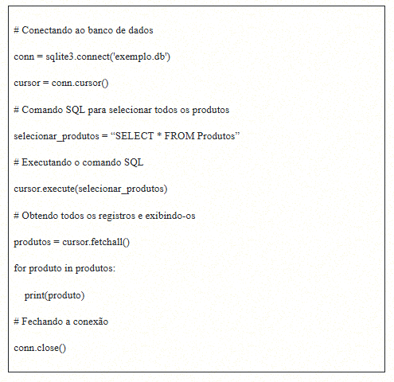

Acompanhe, agora, um exemplo de como atualizar o preço de um produto específico na tabela “Produtos”:

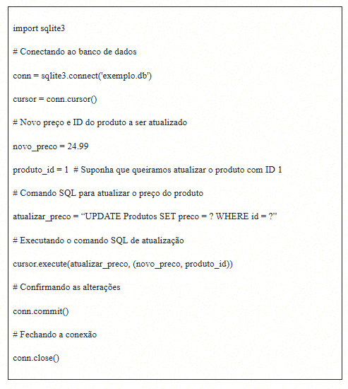

Observe, a seguir, um exemplo de como excluir um produto da tabela “Produtos” com base no seu ID:

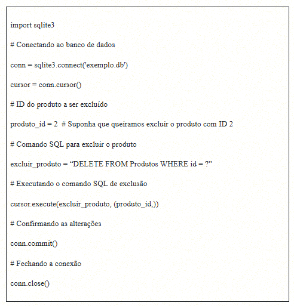

É importante lembrar que esses são exemplos simplificados. Em uma aplicação real, talvez você precise adicionar tratamento de erros, validação de dados e outros recursos extras. Por isso é essencial sempre praticar e analisar cada vez mais exemplos para compreender tais conceitos.
